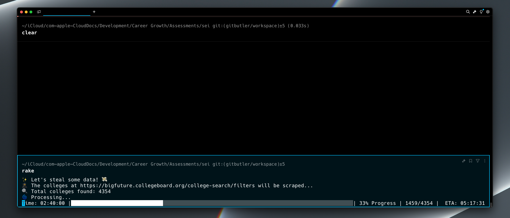

# Strategic Education, Inc. Coding Assessment

This project is a college crawler that scrapes the [College Board website](https://bigfuture.collegeboard.org/college-search/filters) for college data and stores it in a PostgreSQL database. Ruby is used to write the script, along with a handful of gems to assist with web scraping actions, database interactions, code quality, and more.

## 🚀 Quick Start

If you already have the correct ruby version installed, and Postgres installed and the service running, you can run the script quickly with the following commands:

```bash
bundle install # install the gems
rake db:create # create the database
rake db:migrate # create the colleges table
rake # scrape the colleges and populate the database ✨

# If you want to resume a previous run of the script, you can run the following command:
rake resume
# Note: we have no guarantee that the source data set has not changed since the last run.

# This script run can take many hours. If you're on a Mac, you may need to run the following command to prevent the computer from sleeping:
caffeinate -i rake
caffeinate -i rake resume # if resuming a previous run
```

> ℹ️ **Info:** If you run into any issues with the script not running, make sure your postgres service is running. You can start it via homebrew with `brew services start postgresql`. Additionally, any scraping failures will be logged in `errors.log` and can be manually remediated following script run.

## 📷 Screenshots



## 📋 Project Setup

> ℹ️ **Info:** You may need to look up the correct installation method for a given step if running Windows or another operating system. These instructions are for Mac running on Apple Silicon using homebrew.

### Step 1: Install Ruby and RVM (Mac)

This is a ruby project, so you'll need to have ruby installed on your machine with the correct version utilized in the project. Using a version manager is recommended.

1. Ruby: Install ruby on your machine
   - `brew install ruby`
2. Install a ruby version manager like `rvm` (or your preferred version manager)
   - visit [rvm.io](https://rvm.io/rvm/install) for installation instructions
   - `\curl -sSL https://get.rvm.io | bash -s stable`
3. Install the ruby version specified in the `.ruby-version` file (3.3.5):
   - `rvm install 3.3.5`
   - Note: if you're on applice silion and receive an error installing ruby 3.3.5, with a message like "Error running '\_\_rvm_make -j8'", you can install openssl and try again, passing the openssl directory to the installation command:

   ```bash
   brew install openssl
   rvm install 3.3.5 --with-openssl-dir=/home/$(whoami)/.rvm/usr
   ```

4. Set your system ruby to the version specified in the `.ruby-version` file (3.3.5)
   - `rvm use 3.3.5`

### Step 2: Install PostgreSQL

We'll be using PostgreSQL to store the scraped college data, and will need to install it on our machine. If you're having any trouble installing or running postgres through homebrew, you can also download postgres and run the service using [Postgres.app](https://postgresapp.com/downloads.html) for Mac.

1. Install PostgreSQL
   - `brew install postgresql`
2. Ensure PostgreSQL is running on your machine
   - `brew services start postgresql` or `brew services start postgresql@14`

### Step 3: Install dependencies

```bash
bundle install
```

Note: if you have any errors when installing `pg` gem, try installing the correct version of `libpq` via: `brew install libpq`

### Step 4: Setup the Database

We need to setup the database and create the `colleges` table, to store the scraped college data.

<!-- TODO: Add instructions on setting up database environmental variables if needed -->

1. Run `rake db:create` to create the database and test_database (for specs)
2. Run `rake db:migrate` to run migrations (will create the `colleges` table)
3. How to drop (if needed): Run `rake db:drop`

## 🕷️ Run the College Crawler

After setting up the project, may now execute the college crawler script to scrape the College Board website and populate the database with data.

```bash
# runs the college scrape task ✨
rake

# If you want to resume a previous run of the script, you can run the following command:
rake resume
# Note: we have no guarantee that the source data set has not changed since the last run.

# Note: this script can take hours to run. You may wish to:
# Runs the task and prevent system sleep 💊
caffeinate -i rake
caffeinate -i rake resume # if resuming a previous run
```

This will take awhile to complete and will populate the database with college data.

> ℹ️ **Info:** Failed API or Puppeeteer actions will retry 15 times. However, total failures past this point will be logged in `errors.log` and can be manually remediated following script run. Any failures writing to the database however will be immediately logged. No failures will hault the continued script execution.

### 🧪 Run Tests

- Run `rake spec` to run the tests for the script and model.
  - You can also use the command `rspec .` to run the tests

## 🛸 Technologies Used

### Language

- Ruby: humancentric language related to SEI's stack, allowing us to write a script to scrape the College Board website for college data.

### Web Scraping

- Sequel: allows us to interact with the database via an ORM, and gives us the advantages of migrations, validations, and more.
- HTTParty: allows us to make HTTP requests to the College Board API (used for the POST request to the API).
  - We are able to obtain most of the data we need via the API, however some data, such as the `college board code`, is not available via the API and requires web scraping.
- Puppeteer: allows us to control the browser and interact with the web page, and extract the data we need from the DOM.
  - In our case, we can get mostly everything *except* the `college board code` from the College Board's API POST request, and we utilize Puppetteer to scrape this remaining data.
- Ruby-ProgressBar: allows us to display a progress bar for the script with elapsed time and ETA of completion.

### Testing

- RSpec: allows us to write tests for our script.
- FactoryBot: allows us to create test data for our `College` model.
- Faker: allows us to create realistic test data for our `College` model.

### Database

- PostgreSQL: allows us to store the scraped college data in a database that's scalable and can be indexed and searched.
  - I chose to go with an SQL based database because the data we needed is highly structured, and also thought Postgres had some advantages over SQL in terms of scalability and performance.

### Debugging and Code Quality

- Debug: allows us to add a `binding.break` break point to the code wherever needed.
- Rubocop: allows us to run a linter to ensure code quality.

## 🚂 Features

- Scrapes all colleges from the College Board website and stores them in `colleges` table
- Fetches total number of colleges from the primary page (script can handle changing source datasets)
- Idempotent (running the script again won't re-write the same data)
- Progress Bar: see real time progress of the scrape
- Throttling: randomly throttles the requests to the College Board website to avoid getting flagged as a bot
- Retry Mechanism: retries the college code scrape if it fails
- Error Handling & Logging: API and Puppeteer Errors are handled gracefully to retry, however after a certain number of attempts any failures will be written to `errors.log` where any outliers could be manually remediated. The script will continue processing the next batch following retry attempts and subsequent failure.

## 🐞 Debugging

- The `debug` gem is included in this project, and imported in the Rakefile, so is available to use throughout the project, as long as running the script via the Rake command.
- Add a `binding.break` to the code to add a break point.

## 🏃‍♂️ Improvements

- Add automated testing suite to repository that runs on CI/CD pipeline
- Add a frontend to the application to allow users to search for colleges by name, city, state, etc.
- Add a public API to allow users to search for colleges by name, city, state, etc.

## 🙏 Thank You Note

Thank you sincerely for the opportunity to complete this for SEI. I really appreicated the uniqueness of this challenge, and had fun building this script.
